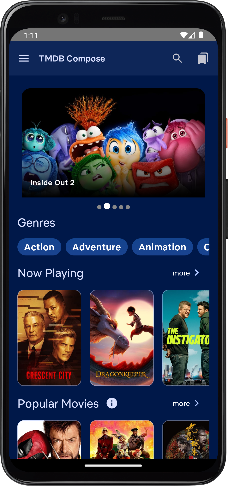
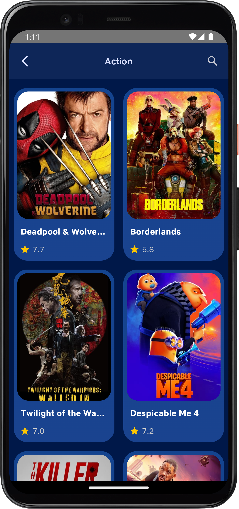
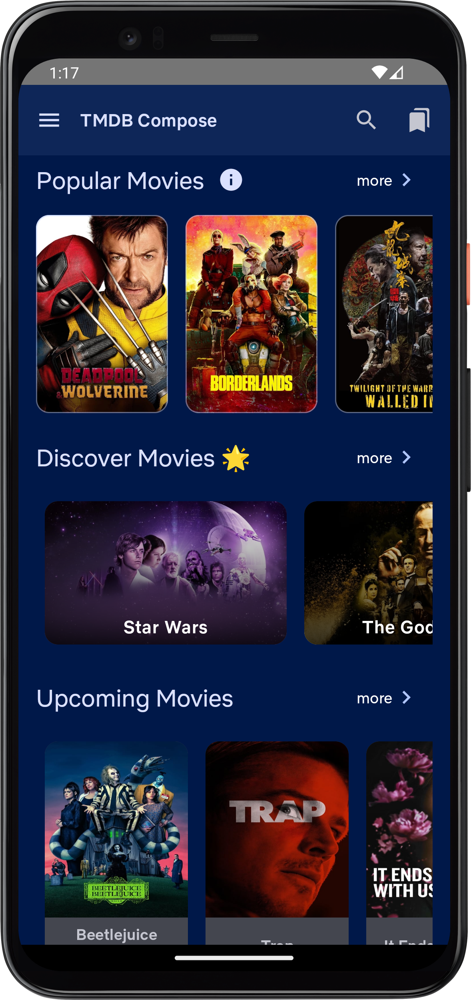
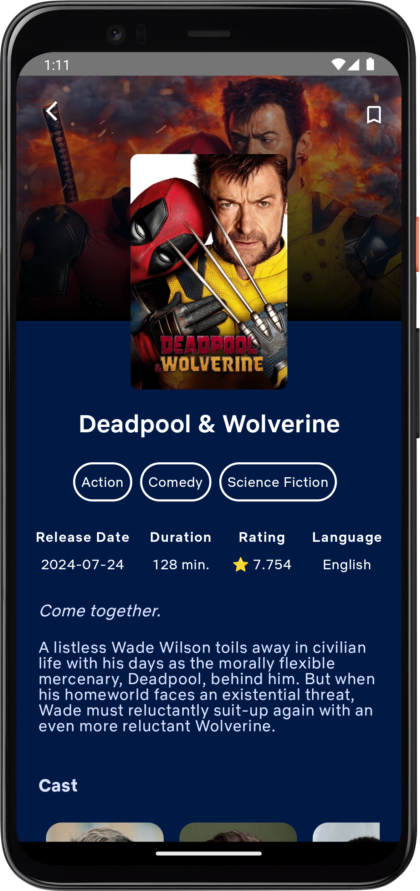
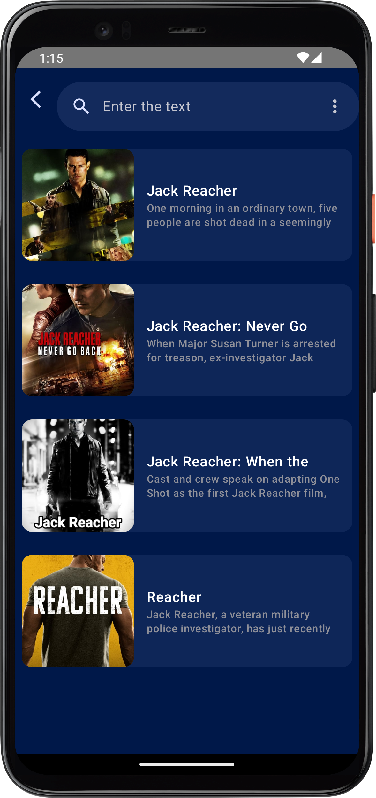
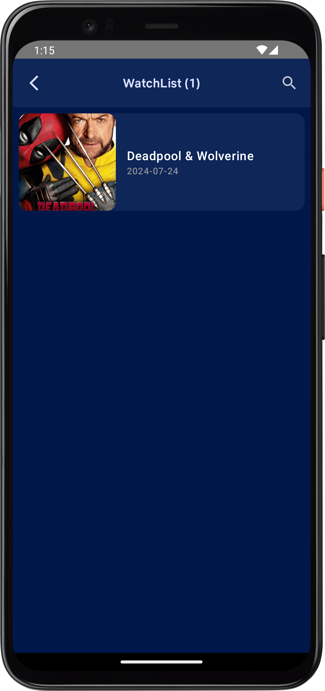

# TMDB Movie App with Jetpack Compose & TMDB API 🎬🎥

Welcome to the **TMDB Movie App**! This app showcases movies from the [TMDB API](https://www.themoviedb.org/documentation/api) while leveraging the power of modern Android development with **Jetpack Compose** and other cutting-edge libraries. 🚀


## Screenshots 📸
| Home Screen | Genres List | Now Playing Movies |
| --- | --- | --- |
|  |  |  |

| Movie Details | Search Movies | Wishlist |
| --- | --- | --- |
|  |  |  |

### 💡 **Technologies Used:**
- ⚛️ **Jetpack Compose** – Modern UI Toolkit
- 🎬 **TMDB API** – Fetch the latest movies, genres, and more!
- 🔗 **Retrofit** – For seamless network calls
- 🏛️ **MVVM Architecture** – Clean, maintainable code structure
- 🛡️ **Dagger-Hilt** – Efficient dependency injection
- 📜 **Paging 3** – Effortless pagination for movie listings
- 💾 **Room Database** – Save and manage your Wishlist
- 🧭 **Navigation Compose** – Smooth navigation experience

## How It Works 💻

1. **Home Screen**: The app starts with an automatic sliding banner featuring the latest movies. Below that, it shows a genres listing, followed by multiple movie sections like "Now Playing", "Popular Movies", "Discover", and "Upcoming Movies".
2. **Genres Listing**: Each genre features a scrollable list of movies displayed using **LazyColumn** and **Paging 3** for seamless pagination.
3. **Movie Details**: Click on a movie to see details like its name, description, language, rating, and more. You’ll also see related movies in the same genre.
4. **Search**: Use the search option to find any movie directly from the server.
5. **Wishlist**: Add your favorite movies to the wishlist using **Room Database** and swipe to remove them easily.

## Libraries Used 📚
- **Jetpack Compose**: Modern UI toolkit for building native Android UIs.
- **TMDB API**: Provides access to movies, TV shows, and cast information.
- **Retrofit**: Type-safe HTTP client for Android and Java.
- **MVVM Architecture**: Separates UI, business logic, and data management for easy maintainability.
- **Dagger-Hilt**: Reduces the boilerplate of manual dependency injection.
- **Paging 3**: Handles large data sets by loading content in chunks.
- **Room Database**: Local persistence for saving favorite movies.
- **Navigation Compose**: Handles app navigation in a declarative way.

## How to Run 🔧

1. Clone the repository:
   ```bash
   git clone https://github.com/Dinesh2510/TMDB-Movie-App-Jetpack-Compose.git
   ```
2. Open the project in Android Studio.
3. Add your **TMDB API Key** in the `local.properties` file:
   ```properties
   tmdbApiKey=YOUR_API_KEY
   ```
4. Build and run the app on an Android emulator or device.

## Contributing 🤝
Feel free to submit pull requests or open issues to improve the app. Contributions are always welcome!

## License 📜
This project is licensed under the MIT License - see the [LICENSE](LICENSE) file for details.

---

Thanks for checking out the **TMDB Movie App**! Don't forget to ⭐ the repository if you find it helpful. 😊

---

Made with ❤️ by [Dinesh Chavan](https://github.com/Dinesh2510)

---


